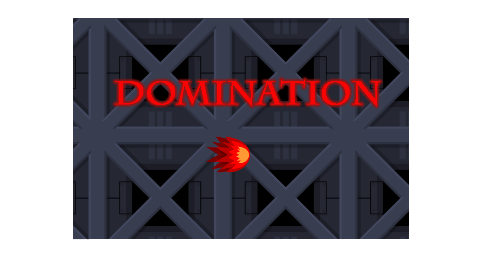
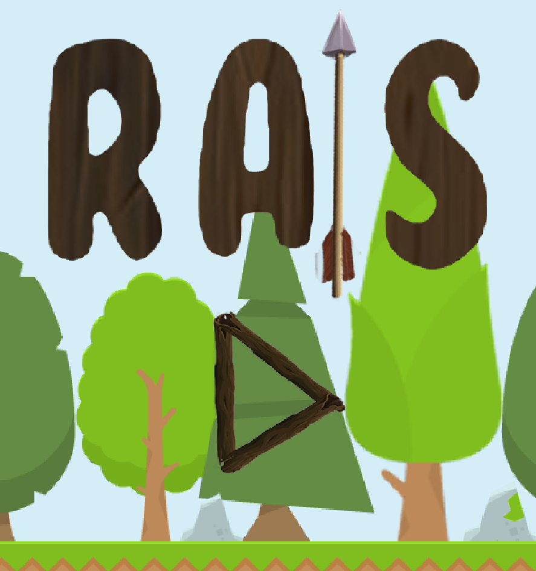
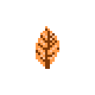
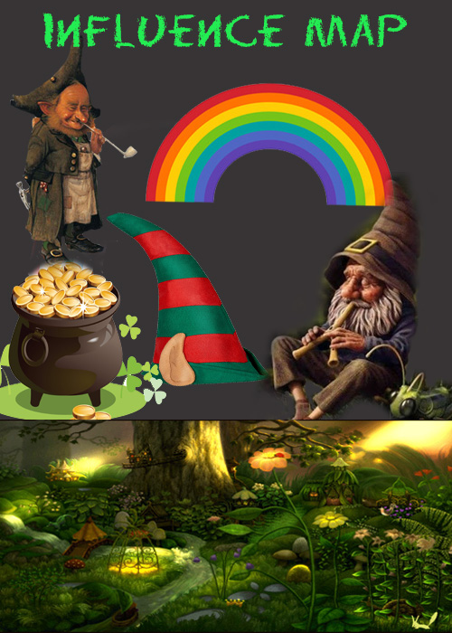

Criando **minha**, _página_, ~~principal~~.

# Quem sou eu?
   **Islanne Monteiro**
18, 084, AÇAÍ - Aluna do 3° ano do cruso Programações Digitais do IFRN/Ceará Mirim.

   
## Contatos
 
 

# Portfólio

## Games

[Texto que vai aparecer](link)

## Artes

## Projetos

1. Tower Defense
O objetivo de jogos de tower defense é tentar impedir que inimigos percorram por um mapa por meio de armadilhas para atrasá-los e torres (ou turrets) que atiram neles enquanto passam. 
Orientador: Marcelo Barbosa

2. Porque os jovens são mais propiços a doenças sexuamente transmissiveis?
Projeto desenvolvido em forma de pesquisa, visando investigar e explicar as causas pelas quais os jovens estão adiquirando as DST'S cada vez mais cedo. 
Orientação de Videany Videnove.
[Baixar arquivo:](Projetobiologia.docx)

1. Marcelo
2. Saulo
3. Idelmárcia
* * *

** negrito  
_ itálico  
~~ riscado  
3* separados por espaço - linha horizontal  
#s uma ou mais hashtsges criam capítulos ou subcapítulos
*s asterico cria lista não ordenada
nºs número seguido de pontuação cria lista ordenada

* * *
