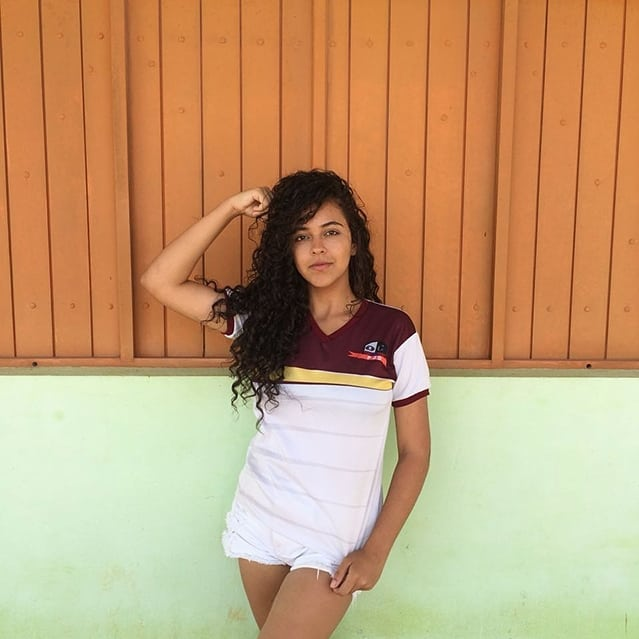

Criando **minha**, _página_, ~~principal~~.

# Quem sou eu?
   **Islanne Monteiro**
18, 084, AÇAÍ - Aluna do 3° ano do cruso Programações Digitais do IFRN/Ceará Mirim.

   
## Contatos

 

# Portfólio

## Games

[Texto que vai aparecer](link)

## Artes

## Projetos

* Proj Tower Defense

1. Marcelo
2. Saulo
3. Idelmárcia
* * *

** negrito  
_ itálico  
~~ riscado  
3* separados por espaço - linha horizontal  
#s uma ou mais hashtsges criam capítulos ou subcapítulos
*s asterico cria lista não ordenada
nºs número seguido de pontuação cria lista ordenada

* * *
