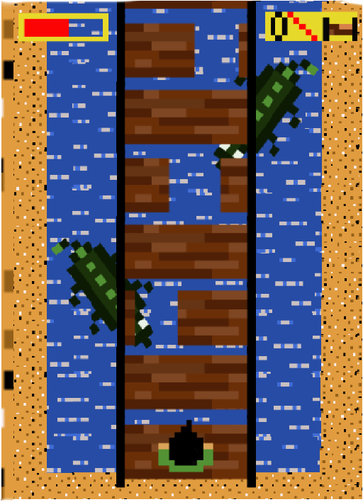

# Quem sou eu?
   **Islanne Monteiro**
- 18, 084. Aluna do 3° ano do cruso Programações Digitais do IFRN/Ceará Mirim.

   
## Contatos
 
           
- _Email: islannemonteiro123@gmail.com_

# Portfólio

## Games

## Artes

 

## Projetos

Tower Defense
- O objetivo de jogos de tower defense é tentar impedir que inimigos percorram por um mapa por meio de armadilhas para atrasá-los e torres (ou turrets) que atiram neles enquanto passam. 

Orientação de Marcelo Barbosa.

[Click para baixar o jogo(Conctruct2).](tower.capx)

 "Porque os jovens são mais propiços a doenças sexuamente transmissiveis?"
- Projeto desenvolvido em forma de pesquisa, visando investigar e explicar as causas pelas quais os jovens estão adiquirando as DST'S cada vez mais cedo. 
Orientação de Videany Videnove.

[Click para baixar o o arquivo.](Projetobiologia.docx)

----------- Obrigada pela atenção! -----------
